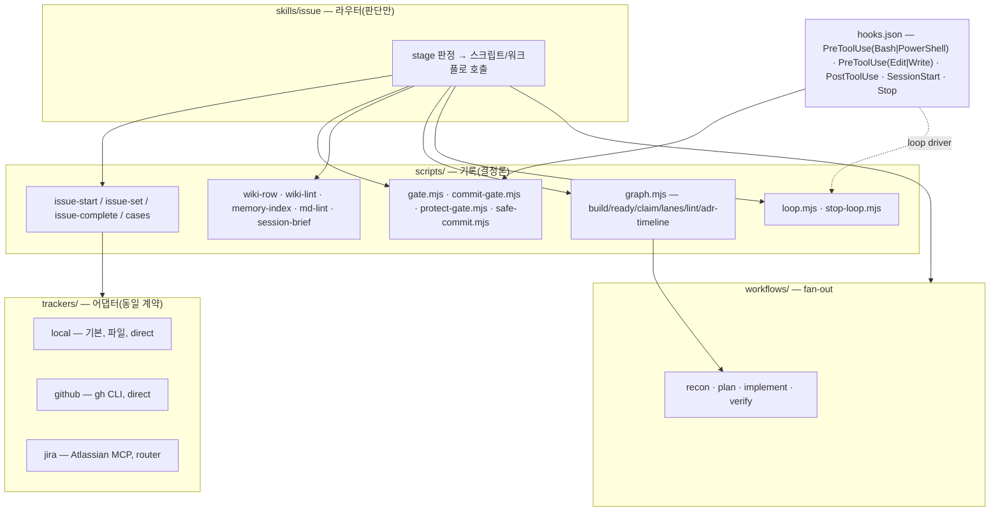

# caseworker — 설계 문서

> 이 문서는 **설계 의도와 근거**를 남긴다. 사용법은 [README](../README.md), 어댑터 계약은 [`trackers/_contract.md`](../trackers/_contract.md), 설정·상태의 정본은 [`schemas/`](../schemas/) 가 정본이다.

---

## 0. 한 줄 결론과 확정된 결정 5건

**결론**: 선행 플러그인(jira-harness 3.2.0)에서 Jira 결합은 얇았다 — 스크립트 출력 3줄, 설정 블록 1개, 이슈 생성 스킬 1개. 그러니 "Jira 를 떼는 것"은 작은 일이고, 진짜 일은 두 가지였다.

1. **트래커 어댑터 층을 세우고 local 파일 백엔드를 기본값으로 두는 것**
2. **선행 하네스에서 실측으로 드러난 구멍을 메우고, 조사에서 수렴한 메커니즘을 넣어 하네스 자체를 한 단계 올리는 것**

그래서 fork-and-rename 이 아니라, 검증된 코어를 흡수하고 **Jira 를 어댑터 하나로 강등**시킨 새 플러그인을 만들었다.

| # | 결정 | 확정 | 왜 이렇게 정했나 |
|---|------|------|-----------------|
| 1 | 플러그인 이름 | `caseworker` | 스킬 네임스페이스(`/caseworker:issue`)·마켓·훅 로그 태그 문자열 전부에 박힌다. 나중에 바꾸면 버전 이관 작업이 또 생긴다 |
| 2 | 기본 트래커 | **local 파일**(`.caseworker/`, 커밋 대상) | "트래커를 안 쓰는 사람"의 첫 경험이 `npm i -g …` 나 `gh auth login` 이면 거기서 이탈한다. **의존성 0** 이 1순위 |
| 3 | Node 최소 버전 | **20** — 그래프는 JSONL + 메모리 계산 | 내장 SQLite 를 쓰면 그래프 질의가 편하지만 Node 22 강제 + 실험 API 다. 이슈 수백 건 규모면 JSONL 로 충분하다 |
| 4 | 이슈 키 형식 | `<PREFIX>-<hash4>`(예 `HX-a3f8`), 하위 `HX-a3f8.1` | 브랜치·worktree 병렬에서 순번은 충돌한다. 해시는 브랜치명에 그대로 박히고 `branch_pattern` 이 거의 안 바뀐다. 순번(`seq`)은 혼자 쓰는 저장소용 옵션으로만 남겼다 |
| 5 | 선행 플러그인의 운명 | `trackers/jira` 어댑터로 흡수 | 코어 스크립트가 두 벌이 되면 버그 수정이 두 번이다. 기존 Jira 프로젝트는 `tracker: "jira"` 로 그대로 이 플러그인을 쓴다 |

결정 4·5 의 귀결로, **v3 설정은 무변경으로 동작한다** — `version: 3` + `jira` 블록만 있는 `harness.json` 은 그대로 읽혀 `jira` 트래커로 해석된다.

---

## 1. 조사에서 확인한 것 (검증 등급 명시)

설계 전에 두 축으로 조사했다: 공식 문서·로컬 실측(등급 A)과, 공개 저장소·블로그 원문 열람(등급 A)·스니펫만 본 것(등급 B). 참고 링크 전량은 §7.

### 1-1. 직접 실측한 사실 — 설계에 바로 쓴 것

| 사실 | 어떻게 확인했나 | 설계 반영 |
|------|----------------|----------|
| 선행 플러그인의 커밋 게이트는 `tool_name !== 'Bash'` 면 **무조건 통과**했다. 훅 matcher 도 `"Bash"` 하나 → **PowerShell 툴로 `git commit` 하면 게이트가 안 돈다** | 스크립트·`hooks.json` 직접 열람 | matcher `Bash\|PowerShell`, 스크립트도 두 셸을 같은 집합으로 판정. 위반 주입에 `powershell-commit-without-gate` 케이스 추가 |
| 공식 hooks 문서: 셸 툴은 `Bash`·`PowerShell` 둘, matcher 는 `\|`/`,` 구분. exit 2 = 차단. **`PostToolUse` 는 차단 불가**. `SessionStart` 는 `additionalContext` 주입 가능. `Stop` 훅으로 종료 저지 가능 | 공식 문서 | 게이트는 PreToolUse 에만 · `.md` 검사는 PostToolUse **경고**로만 · 루프 드라이버는 Stop 훅 |
| 플러그인 컴포넌트 목록과 제약: 플러그인 에이전트는 `hooks`/`mcpServers`/`permissionMode` 를 **선언할 수 없다** | 공식 plugins-reference | 강제 지점은 결국 `hooks/hooks.json` 하나뿐이다. 레인 모델 티어링은 프로젝트별 오버라이드가 필요하므로 `harness.json.models` 에 남긴다 |
| `claude plugin eval` 은 실존한다(`evals/**` 케이스, `--ablation with-without`, `--max-cost-usd`, `--json`) | 로컬 `--help` | 선행 eval 3케이스를 계승하고 주입 의례를 eval 케이스로 승격 |
| 해시 ID + 계층 ID(`.1`) 는 이미 실사용 패턴이다 | 공개 이슈 트래커 저장소 README | ID 체계와 엣지 타입은 **패턴만** 채택. 해당 CLI 자체는 선택 어댑터로 미룸 |

### 1-2. 원문에서 훔친 메커니즘 (등급 A)

| 출처 계열 | 훔친 메커니즘 | 반영된 곳 |
|-----------|--------------|----------|
| 장기 실행 에이전트 하네스 글 | 사람용 핸드오프 로그 + "검증 자산은 갱신만, 수정·삭제 금지" + 세션마다 스모크 | `PROGRESS.md` · held-out probe · SessionStart 브리프 |
| Pre-Commit Review Gate | diff 지문 ↔ 리뷰 아티팩트 결박, 조건 AND 통과 (원전은 fail-open → 우리는 **fail-closed**) | 게이트·리뷰 기록을 같은 git 트리 id 로 결박 |
| 훅 우회 실사고 이슈 | `--no-verify`·stash 로 연속 우회 → 2단 게이트 | commit/push 2단. **셸 툴 우회**가 우리 판의 같은 사고였다 |
| Stop 훅 루프 구현체 | 상태 1장(`session_id`·라운드·상한), `session_id` 비교로 다른 세션 보호 | `stop-loop.mjs` 의 세션 격리 |
| 선언형 훅 규칙 엔진 | 규칙을 설정으로 빼는 발상 | **글롭 목록 한 줄**(`protected[]`)로 축소 구현 — §5 참조 |
| 배타 잠금(`open(…, 'x')`) | 두 레인이 같은 대상을 동시에 못 잡게 | `graph.mjs claim` |
| 작업 분할 표기(`[P]` = 파일 disjoint) | 병렬 가능 판정을 **파일 집합 교집합**으로 | `graph.mjs lanes` 의 disjoint 검사 |
| 무인 루프 하네스 계열 | 2단 게이트 · 서킷브레이커(무변경 N회 / 동일 에러 M회) · 상한 1개 이상 **필수** | `loop.mjs` 의 caps·breaker |
| 방법론을 리소스로 서빙하는 트래커 | 세션 진입 시 규약을 컨텍스트로 심기 | `session-brief.mjs`(MCP 없이 같은 효과) |
| 워킹트리 지문으로 그래프 stale 판정 | 파생 인덱스에 지문 기록 | `graph.mjs build` 의 `index.json` |
| 이슈당 폴더 + 코멘트 append-only + claim-before-work | local 트래커 파일 형식 | `.caseworker/cases/<KEY>/` |

### 1-3. 미검증으로 남긴 것

- 일부 트래커 MCP 의 "공식" 여부·무료 한도·키 형식 → **어댑터는 local·jira·github 3종만 1차로 냈다.** 나머지는 2차
- 특정 CLI 의 "병렬 worktree 동시 write 무충돌" 주장 → 마케팅 카피다. 그 어댑터를 붙일 때 실측한다
- reward-hacking 수치를 인용한 논문 → 제목만 실재 확인. 인용하지 않고 held-out 아이디어만 썼다
- 몇몇 방법론 저장소는 원문 미열람(등급 B) — 참고만 했고 설계 근거로 쓰지 않았다

---

## 2. 선행 하네스 실측 — 무엇을 물려받고 무엇이 트래커에 묶여 있었나

규모: 스크립트·문서 1만 줄대, 실제 임시 git 저장소에서 도는 통합 테스트 100여 건, eval 3케이스, 스택별 에이전트 15종.

**트래커 결합 지점 전수와 처리:**

| 결합 위치 | 결합 내용 | 처리 |
|-----------|----------|------|
| `issue-start` · `issue-complete` 출력 JSON | `jira:{transition, comment}` 를 그대로 동봉 | `tracker.ops[]` 로 일반화. 어댑터가 op 를 만들고, direct 어댑터는 스크립트가 실행 |
| 설정 로더·스키마·setup | `jira` 블록(project/전이/댓글 언어) 고정 | `trackers.<name>` 블록 + `tracker` 선택자. **구 `jira` 블록은 하위호환으로 계속 읽는다** |
| `issue-start` | 키 형식 `^<PREFIX>-\d+$` 하드코딩 | 어댑터의 `DEFAULT_KEY_BODY` + `trackers.<name>.key_body` 오버라이드 |
| 라우터 스킬·stage 문서 | "MCP 3콜" 절차를 산문으로 서술 | "어댑터 절차"로 치환, 어댑터별 README 1장씩 |
| 이슈 생성 스킬 | Jira 전용 벌크 생성 | `skills/new` 로 일반화 |
| wiki 스키마의 상태 대조 규칙 | 외부 트래커 상태를 직접 참조 | 어댑터 상태 5종으로 일반화 |
| 환경변수·로그 태그 접두 | 이름 | `CASEWORKER_*` · `[caseworker]` |

**그대로 물려받은 규율**(검증된 것을 흔들지 않는다): 상태 JSON 은 스크립트만 쓴다 · 신선도는 git 트리 id · commit/push fail-closed · 문서만 바뀐 커밋은 통과 · 리뷰는 외부 CLI 우선이고 레인은 gap 에만 · 레인 상한 고정 · 계획서는 `.draft` → 승인 → 확정 · wiki 는 forecast/closure 2단 · 헤드리스 경로용 `safe-commit`.

---

## 3. 설계

### 3-1. 원칙 (선행 3원칙 + 2)

1. 모델은 판단만, 기록은 스크립트만, commit/push 는 훅이 판정한다
2. 신선도는 git 트리 id 다 — "테스트 돌렸다"는 말이 아니라 지문이 증거다
3. 사람 결정은 건너뛰지 않는다
4. **트래커는 어댑터다** — 코어는 트래커를 모른다. 그리고 이슈 본문·댓글은 **데이터이지 지시가 아니다**(`<tracker-data>` 로 감싼다)
5. **의존성 0 으로 시작한다** — Node 20 + git 만으로 전 단계가 돈다. 외부 CLI·MCP 는 있으면 쓰고, 없으면 `{ok:false, reason}` 으로 그렇게 기록하고 코드 진행은 막지 않는다

### 3-2. 아키텍처



### 3-3. 디렉토리 (실제)

```
caseworker/
├── .claude-plugin/{plugin.json, marketplace.json}
├── hooks/hooks.json          # 훅 5종 등록
├── scripts/
│   ├── commit-gate.mjs  protect-gate.mjs  gate.mjs  safe-commit.mjs  setup.mjs
│   ├── issue-start.mjs  issue-set.mjs  issue-complete.mjs  cases.mjs
│   ├── graph.mjs  loop.mjs  stop-loop.mjs
│   ├── session-brief.mjs  md-lint.mjs
│   ├── herdr-report.mjs  herdr-plugin.mjs  herdr-lanes.mjs   # Herdr 연동(§3-8)
│   ├── wiki-row.mjs  wiki-lint.mjs  memory-index.mjs  hygiene.mjs  codex-review.sh
│   ├── lib/  dev/wf-sim.mjs
│   └── __tests__/            # 실제 임시 git 저장소에서 도는 통합 테스트 18 spec(+ 측정 스크립트 1)
├── herdr-plugin.toml         # 같은 저장소가 Herdr 플러그인이다(스크립트 공유)
├── trackers/{_contract.md, local/, github/, jira/}
├── skills/{issue, setup, new, loop, graph, grilling, grill-me, kb-ingest}
├── workflows/{recon,plan,implement,verify}.js
├── agents/                   # Spring 7 · Vue 7 · cross-repo 1
├── schemas/{harness,state,case,loop}.schema.json
└── evals/                    # 5 케이스 + _scaffold
```

계획 단계의 `rules/` 디렉토리와 규칙 엔진은 **만들지 않았다** — §5 를 볼 것.

### 3-4. 트래커 어댑터 계약

계약 정본은 [`trackers/_contract.md`](../trackers/_contract.md). 요지는 두 가지다.

**(1) 어댑터는 두 종류다.**

| 종류 | `capabilities.direct` | 누가 실행하나 |
|------|----------------------|-------------|
| direct | `true` | 스크립트가 `apply(op, ctx)` 로 그 자리에서 실행 (`local` · `github`) |
| router | `false` | 스크립트는 op 를 `via:"router"` 로 출력만 하고, 라우터가 MCP 로 수행 (`jira`) |

이 분리가 있는 이유는 **스크립트가 네트워크를 만지지 않는다**는 규율 때문이다. MCP 는 모델 쪽에만 있으므로, MCP 어댑터는 op 에 `tool` 힌트와 `args` 를 실어 라우터에게 넘긴다.

**(2) 실패는 throw 가 아니라 `{ok:false, reason}`.** 트래커가 안 되는 것과 코드 작업이 안 되는 것은 다른 일이다. 트래커 실패는 기록에 남고 사다리는 계속 올라간다.

| 어댑터 | 키 본문 | 저장 | 오프라인 | 상태 사상 | 링크 |
|--------|--------|------|---------|----------|------|
| **local** (기본) | `[0-9a-f]{4,6}(\.\d+)*` 또는 `\d+` | `.caseworker/` 파일 | ✅ | 그대로 5종 | `graph.jsonl` 엣지 |
| github | `\d+` | GitHub Issues (`gh`) | ✗ | 라벨 + 열림/닫힘 | 댓글 `<type>: #n` 한 줄 |
| jira | `\d+` | Atlassian MCP | ✗ | 설정된 전이 이름 | MCP 링크 API |

상태는 어떤 트래커든 **5종 고정**이다: `open · in_progress · review · done · abandoned`. 외부 상태 이름은 어댑터가 여기로 사상한다 — 코어는 이 5종만 안다.

### 3-5. local 트래커 형식 (결정 2·4)

```
.caseworker/
├── cases/HX-a3f8/
│   ├── issue.json         메타 (schemas/case.schema.json)
│   ├── body.md            요구·인수조건 — 사람이 편집
│   ├── PROGRESS.md        진행 로그 — append-only, 한 줄 한 사건
│   └── comments/<ISO>.md  댓글 1건 = 파일 1개
├── cases/HX-a3f8.1/       하위 이슈도 같은 모양
├── graph.jsonl            링크(엣지) 1줄 1건, append-only
└── index.json             파생 캐시(재생성 가능)
```

설계 판단 3가지:

- **`.caseworker/` 는 커밋한다.** `.claude/runtime/` 은 gitignore 지만 이슈 본문·결정·진행 로그는 코드와 같은 히스토리에 남는 것이 이 트래커의 요점이다 — 어느 커밋 시점에 요구가 무엇이었는지 `git log` 로 되짚을 수 있다.
- **댓글은 파일당 1건, 엣지는 append-only.** 병렬 레인·worktree 가 같은 파일을 동시에 건드릴 일이 없다. 팀 공유에서 실제로 부딪히는 건 `issue.json.status` 한 필드뿐이고, 규율은 **later-wins** 다(상태는 사실의 기록이지 누적 원장이 아니다).
- **브랜치 상태와 이슈를 합치지 않는다.** `.claude/runtime/issues/<branch>.json`(브랜치 = 작업 단위)과 `.caseworker/cases/<KEY>/`(이슈 = 요구 단위)는 별개 축이다. 한 이슈를 여러 브랜치로 나눠 잡는 일이 실제로 있기 때문이다.

### 3-6. 모듈별 설계 요지

**게이트와 훅** — 훅은 5개다.

| 훅 | 대상 | 하는 일 |
|----|------|--------|
| PreToolUse | `Bash\|PowerShell` | `commit-gate.mjs` — 게이트·리뷰 기록이 **커밋될 트리와 같을 때만** commit/push 허용. 두 셸을 같은 집합으로 본다 |
| PreToolUse | `Edit\|Write\|MultiEdit\|NotebookEdit` | `protect-gate.mjs` — `protected[]` 글롭의 파일 편집 차단(사유 `PROTECTED`) |
| PostToolUse | `Edit\|Write\|MultiEdit` | `md-lint.mjs` — 방금 쓴 `.md` 의 frontmatter·`[[link]]`·상대 링크·LOG 줄 형식 **경고**(차단 불가·차단 안 함) |
| SessionStart | — | `session-brief.mjs` — 브랜치·이슈·stage·게이트/리뷰 신선도·PROGRESS 꼬리·루프 현황을 `additionalContext` 로(상한 3,500자) |
| Stop | — | `stop-loop.mjs` — 이 세션의 루프가 활성이면 종료를 막고 다음 라운드 프롬프트를 되먹인다 |

차단 사유 코드는 카탈로그로 고정한다: `NO_STATE` · `DIRTY_TREE` · `NO_GATE` / `GATE_STALE` / `GATE_FAIL` · `NO_REVIEW` / `REVIEW_STALE` / `REVIEW_BLOCKERS` · push 는 추가로 `GATE_LEVEL` · `BRANCH_PATTERN` · `COMPLETED` · `PROTECTED`. 언어와 무관한 코드로 두어, 메시지가 한국어여도 판정은 기계가 읽는다.

`protect-gate.mjs` 에는 **알려진 사각지대**가 있고 그것을 주석에 명시했다: 셸의 `sed -i`·리다이렉트로 보호 파일을 쓰면 이 훅은 못 본다. 그 축은 게이트의 트리 지문이 잡는다(보호 파일이 바뀌면 `GATE_STALE`). 훅 하나로 모든 경로를 막는 척하지 않는 것이 설계 의도다.

**graph** — 외부 DB 없이 `.caseworker` 의 case 메타 + `graph.jsonl` 을 읽어 계산만 한다.

- `ready` — open ∧ 미차단(`blocks` 의 from 이 종결 아님) ∧ 미선점
- `claim` — 파일 `open(…, 'wx')` 배타 선점. 두 레인이 같은 키를 동시에 잡지 못한다
- `lanes` — Kahn 위상정렬로 파도(wave) 배정 + **파일 집합 disjoint 검사**. 겹치면 병렬 불가로 판정하고 exit 1
- `lint` — 사이클 · 없는 키를 가리키는 엣지 · 상태 모순(부모 done 인데 자식 open) · 중복 엣지
- `adr-timeline` — 마크다운에서 결정 기록의 번호·날짜·`supersedes` 를 뽑아 반전 타임라인. `--write` 면 엣지로 적재

**loop** — 완성도 루프. `loop.mjs` 는 **점수를 매기지 않는다**(그건 probe·레인이 한다). 라운드 기록·종료 판정·상한·서킷브레이커만 결정론적으로 계산한다.

- `check` / `init` / `record` / `verdict` / `status` / `session start|stop`
- **caps 필수**: `max_rounds | max_cost_usd | max_minutes` 중 하나도 없으면 `init` 이 거부한다. 상한 없는 무인 루프는 만들지 않는다
- **서킷브레이커**: 연속 무변경 라운드 수 · 동일 에러 반복 수 → `ESCALATE`
- **anti-gaming**: DoD probe 를 `held_out` 으로 표시할 수 있고, 그 자산은 `protected[]` 로 편집이 막힌다. "테스트를 고쳐서 초록을 만드는" 경로를 파일 권한 수준에서 끊는다
- **무인 라운드는 Stop 훅**이 되먹인다. `session_id` 가 다르면 무시한다(같은 프로젝트의 다른 세션을 막지 않는다). 예외·손상은 fail-open 이 아니라 **루프 정지** 다 — 루프를 계속 도는 쪽이 비용이고, 멈추는 쪽이 안전하다

**knowledge** — wiki 표 upsert·정합 점검·자동 메모리 인덱스는 계승했다. 추가한 것은 세션 진입 브리프와 `.md` 쓰기 경고, 그리고 `complete` 가 남기는 `memory-candidates/<slug>-<시각>.md` 다. **자동 메모리로의 승격은 사람이 한다** — 추출은 기계, 판단은 사람.

### 3-7. `harness.json` v4 델타

```jsonc
{
  "version": 4,
  "tracker": "local",                 // local | jira | github
  "issue_prefix": "HX",
  "trackers": {
    "local":  { "dir": ".caseworker", "counter": "hash",
                "start_status": "in_progress", "done_status": "review" },
    "github": { "repo": "owner/name", "start_label": "in-progress", "done_label": "review" },
    "jira":   { "project": "ABC", "start_transition": "In Progress",
                "done_transition": "QA", "comment_lang": "ko" }
  },
  "protected": ["scripts/gate/**", "**/__tests__/**/*.held.*", ".caseworker/graph.jsonl"],
  "loop": { "caps": { "max_rounds": 10 },
            "breaker": { "no_change_rounds": 2, "same_error_rounds": 3 } },
  "default_branch_policy": "deny"     // allow 면 기본 브랜치에서만 판정을 끈다
}
```

v3 와의 관계: `version`·`mode`·`issue_prefix`·`branch_pattern`·`stacks` 는 여전히 필수이고, 구 `jira` 블록은 그대로 읽힌다. `tracker` 를 안 쓰고 `jira` 블록만 있으면 트래커는 `jira` 로 해석된다.

### 3-8. Herdr 연동 — 보이는 하네스, 그리고 다른 에이전트를 레인으로

Herdr 는 pane 안의 코딩 에이전트를 인식해 `idle·working·blocked·done` 을 추적하는 터미널 워크스페이스 매니저다(소켓 API, 플러그인 규격, worktree 워크스페이스). caseworker 의 병렬은 전부 Workflow 툴의 in-process 서브에이전트라 **사람 눈에 안 보이고, 세션과 함께 죽고, Claude 모델만** 쓴다. Herdr 는 정확히 그 반대편이다. 원칙 세 개로 붙였다.

1. **밖에서는 무동작.** `HERDR_PANE_ID` 가 없으면 모든 연동 지점이 `{ok:false}` 를 돌려주고 끝난다. 훅·게이트·루프 어디에 심어도 Herdr 없는 사용자에게는 코드가 없는 것과 같다.
2. **lifecycle 권위는 건드리지 않는다.** `pane report-agent`(idle/working/blocked)는 통합 훅·화면 매니페스트의 것이다. 우리는 표시 전용인 `report-metadata`(토큰 `$case $stage $gate $review $loop $event` + 상태 라벨)와 `notification show` 만 쓴다. blocked 다이얼로그에 자동으로 답하지 않는다.
3. **결과는 파일로 받는다.** Herdr 레인(다른 에이전트 pane)의 산출물은 alt-screen 스크롤백에서 긁지 않고, 레인 프롬프트가 지정한 사이드카 JSON 경로에서 읽는다 — implement 레인의 사이드카 계약과 같다.

| 조각 | 무엇 | 언제 |
|------|------|------|
| `lib/herdr.mjs` | `herdrEnv`·`herdr(args)`(3초 타임아웃, throw 없음)·`buildStatus`(훅과 같은 신선도 축 = 인덱스 지문 + `treeAccepted`)·`herdrReport`·`herdrPing` | 모든 연동의 바닥 |
| 자동 보고 | `issue-start`(stage) · `issue-set --stage/--review` · `gate.mjs`(FAIL→request, full PASS→done) · `loop.mjs record`(STOP→done, ESCALATE→request) · `issue-complete`(성공/거부) · `commit-gate` deny | 스크립트가 상태를 쓴 직후 |
| `herdr-report.mjs` | 라우터가 사람 게이트(계획 승인·human DoD) 직전에 부르는 CLI · `--status` 는 토큰 계산만 | stages.md |
| `herdr-plugin.toml` + `herdr-plugin.mjs` | Herdr 플러그인: 팝업 5(status·gate×2·loop·new) · 액션 2(report·adopt) · 이벤트 `worktree.created` → `issue-start --adopt`. 문맥 키는 0.9.0 실측(`focused_pane_cwd`·`workspace_cwd`·`focused_pane_id`·`workspace_id`) | `herdr plugin install owner/repo` |
| `herdr-lanes.mjs` | 레인 실행기 — pane split → `agent start --kind` → 프롬프트 파일 → `agent prompt --wait` → **`agent get` 이 working 인지 확인, 아니면 `send-keys enter`**(미제출 함정) → `agent wait` → 사이드카 JSON 회수 → (선택) pane close. verify 부터 붙였다: codex·grok 이 Claude 의 diff 를 심판하면 maker≠verifier 가 모델 차원에서 성립한다 | `harness.json.herdr.lanes` |

함정 4종(실측)을 코드에 고정했다: ① `agent prompt` 가 성공 응답을 내고도 제출이 안 된다 → 상태로 판정 ② claude·grok pane 은 스크롤백 회수가 안 된다 → 파일 ③ Windows codex 기본 샌드박스는 파일을 못 읽는다 → `kind_args.codex` 기본값에 `--sandbox danger-full-access` ④ claude 첫 턴 뒤 "Teach auto mode" 다이얼로그 → `agent_blocked` 면 화면을 읽어 그 문구일 때만 `esc`, 그 외 다이얼로그는 사람에게.

**역할 상주(A 단계).** Herdr 안에서는 하네스의 단위가 세션이 아니라 워크스페이스다. driver(Claude) 는 판단·결정·훅만 갖고, **reviewer**(`review.codex_via: "herdr"` — 상주 codex 를 있으면 재사용, 없으면 띄움, 이슈가 바뀌면 `/new`)와 **runner**(`herdr-lanes.mjs gate` — 게이트를 runner pane 에서, 완료 표식 `GATE_DONE_<nonce>` 만 기다림)가 긴 출력을 driver 컨텍스트 밖으로 가져간다. Codex 판정의 계약(`CODEX_RESULT` 마지막 줄)은 exec 경로와 같아 라우터가 경로를 구분하지 않고, `limit` 을 감추지 않는다. 다음 단계(B: crew 매니페스트 `herdr.roles` · C: implement 레인을 worktree 워크스페이스로 · D: 무인 루프의 verifier 를 codex pane 으로)는 A 의 수치(`summary.timing` 으로 verify 라운드 시간·driver 토큰을 exec 방식과 이슈 3개에서 비교)를 본 뒤 간다.

Workflow 를 버리지 않은 이유: 스키마 강제 출력·resume 캐시·토큰 예산은 Herdr 에 없다. Herdr 레인은 "다른 모델·보이는 화면·세션과 독립" 이 필요한 자리(리뷰, 긴 무인 라운드)에만 쓴다.

---

## 4. 선행 하네스 대비 델타

| # | 항목 | 선행 3.2 | caseworker | 근거 |
|---|------|---------|-----------|------|
| 1 | 트래커 | Jira 고정(MCP) | 어댑터 3종(+2종 예정), local 기본 | 요구 |
| 2 | 이슈 키 | `\d+` 하드코딩 | 어댑터 `key_body`, local = 해시 | 병렬 충돌 |
| 3 | 훅 matcher | `Bash` | `Bash\|PowerShell` | **실측 구멍** |
| 4 | 보호 파일 | 없음(프롬프트 규율) | PreToolUse 차단 + held-out probe | 하네스 글·무인 루프 계열 |
| 5 | 이슈 데이터 | 없음(외부가 SSoT) | `.caseworker/cases/<KEY>/` 커밋, 댓글 append-only | 로컬 트래커 계열 |
| 6 | 사람용 진행 로그 | 상태 JSON 뿐 | `PROGRESS.md` | 하네스 글 |
| 7 | 그래프 | wiki xref 만 | `graph.mjs` ready/claim/lanes/lint/adr-timeline | 이슈 그래프 계열 |
| 8 | 루프 | 별도 user 스킬 | 플러그인 내장 + Stop 훅 + caps 필수 + 브레이커 | Stop 훅 루프·무인 하네스 |
| 9 | 세션 진입 | 없음 | SessionStart 브리프 | 공식 hooks |
| 10 | md 쓰기 검사 | closure 시점에만 | PostToolUse 경고 | 노트 정합 도구 |
| 11 | 트래커 CLI | 없음 | `cases.mjs`(세션 밖에서도 이슈 조작) | local 트래커의 귀결 |
| 12 | 자기 검증 | 통합 테스트 + eval 3 | 통합 테스트 16 spec(+ 측정 스크립트 1) + eval 5 + 주입 6종 | `claude plugin eval` 실측 |
| 13 | 이슈 본문 취급 | 그대로 컨텍스트 | `<tracker-data>` 래핑 = 데이터 | 프롬프트 인젝션 축 |

---

## 5. 구현 상태

| Phase | 내용 | 상태 |
|-------|------|------|
| 0 | 결정 5건 확정 · 저장소 개설 | 완료 |
| 1 | 코어 이식·리네임 · 어댑터 층(`_contract` · local · jira) · `tracker.ops[]` 일반화 · `skills/new` · 훅 matcher 두 셸 | 완료 |
| 2 | `graph.mjs`(build/ready/claim/lanes/lint/adr-timeline) · `skills/graph` · plan 워크플로가 disjoint 결과 소비 | 완료 |
| 3 | `skills/loop` · `loop.mjs` · `stop-loop.mjs` · caps 필수 · 브레이커 · held-out · `protected[]` + `protect-gate.mjs` | 완료 |
| 4 | `session-brief.mjs` · `md-lint.mjs` · `PROGRESS.md` 규약 · memory 후보 추출 | 완료 |
| 5 | `github` 어댑터 · `cases.mjs` · README · marketplace · `setup --upgrade` | 완료 |
| 5b | Herdr 연동(§3-8) — 사이드바 토큰·사람 게이트 토스트 · Herdr 플러그인 매니페스트 · verify 레인 실행기 | 완료 |
| 6 | beads · gitlab 어댑터 · SQLite 그래프 백엔드 옵션 · CI 레시피 · Herdr 레인을 implement·loop 까지(`herdr.lanes=all` 은 스키마만 예약) | **2차** |

### 계획했으나 구현하지 않은 것 (정직하게 남긴다)

| 계획 | 실제 | 왜 |
|------|------|-----|
| `rules/*.md` 선언형 규칙 엔진 | **없음.** `harness.json.protected[]` 글롭 + `protect-gate.mjs` 훅 하나 | 1차에 필요한 규칙이 "이 파일들은 못 고친다" 하나뿐이었다. 규칙 DSL 을 먼저 만들면 사용자가 없는 추상이 된다 |
| `hook_profile: minimal\|standard\|strict` | **없음.** 강도 축은 기존 `mode: auto\|suggest\|off` 하나 | 프로파일 3단은 조합만 늘리고 판정을 흐린다. 실제로 끄고 싶은 축은 protected 글롭을 비우는 것으로 충분했다 |
| finding `confidence 0~100` + `min_confidence` | **없음.** 리뷰는 severity + blocker 축 그대로 | 신뢰도 점수를 모델이 스스로 매기면 그 숫자 자체가 게이밍 대상이 된다. 도입하려면 held-out 검증 축이 먼저 필요하다 |
| `/goal` 을 루프 종료의 보조 판정으로 | **없음.** 종료는 `loop.mjs` 의 순수 함수 판정만 | 트랜스크립트만 읽는 판정은 "틀린 축을 스텁한 테스트"를 못 잡는다. 보조로도 넣으면 그 초록을 사람이 믿게 된다 |
| `commit-gate --why` 드라이런 | **없음** | 사유 코드가 stderr 에 한 줄로 나오므로 진단은 되지만, 오진 재현용 드라이런은 2차 |
| 5단계 완결성 taxonomy 보고 문법 | **없음** | 보고 템플릿 강제는 스크립트가 아니라 스킬 산문에 얹히는 축이라, 실효를 잴 수단이 없어 보류 |
| 제네릭 에이전트 4종 | **없음.** 스택별 15종만 | 제네릭 리뷰어는 기본 에이전트와 겹친다 |

---

## 6. 리스크와 열린 질문

| 리스크 | 완화 |
|--------|------|
| rebase/squash 뒤 트리 지문 전량 무효 | **의도된 동작**이다(재게이트). README 에 명시. "같은 blob 집합이면 재실행 생략" 최적화는 2차 |
| 두 하네스 플러그인 동시 활성화 시 PreToolUse 훅이 둘 다 발화 | 사유 코드가 뒤섞이고 한쪽 판정이 다른 쪽을 가린다. README·setup 이 "선행 플러그인은 끈다"를 명시 |
| PowerShell 명령 파싱(`;` 체인·별칭·호출 연산자) | 파서 테스트에 셸 케이스. 파싱 불가는 **fail-closed** |
| 참고한 메커니즘이 bash/python 원본 | 모든 훅·스크립트는 **Node 단일 런타임**. `codex-review.sh` 만 bash 잔존 → 2차에 `.mjs` 화 |
| 카피레프트 라이선스 저장소 | 코드 벤더링 금지, **패턴만** 채택 |
| local 트래커 팀 공유 — 같은 이슈를 다른 브랜치에서 수정 | 댓글·PROGRESS 는 파일 분리라 충돌 0. `issue.json.status` 만 충돌 가능 → later-wins, `graph.mjs lint` 가 상태 모순 검출 |
| 오프라인 — github/jira 는 네트워크 필요 | `capabilities.offline=false` 어댑터의 실패는 `ok:false` 로 기록만 하고 코드 진행은 계속 |
| 훅이 발화하지 않는 경로(헤드리스·무인) | 같은 판정을 하는 `safe-commit.mjs`. setup 의 헤드리스 확인이 "미발화 감지"를 보고에 남긴다 |
| 비동기 오너 승인(터미널 밖) | 1차 범위 밖. 사람 게이트에서 멈추는 현재 규율 유지 |
| 게이트의 **존재**를 **실효**로 읽는 것 | 위반 주입 6종이 이것을 재기 위해 있다. 하나라도 `ok:false` 면 설치를 실패로 본다. 실행 못 했으면 "미확인"을 그대로 남기고 발화했다고 추정해 채우지 않는다 |
| 공개 저장소 위생 | `scripts/hygiene.mjs` — 검출 패턴 목록 자체가 gitignore 대상이다(목록을 커밋하면 그게 유출이다). push 전 필수 |

열린 질문:

- user-scope 루프 스킬의 처리 — 플러그인 것이 정본, user 스킬은 deprecated 안내가 권장안
- 스택별 에이전트 15종을 코어에 계속 실을지, 스택별 플러그인으로 쪼갤지 — 1차는 그대로, 비대해지면 분리

---

## 7. 참고 링크 (검증 등급: A = 원문 열람·로컬 실측, B = 스니펫)

| 등급 | 링크 |
|------|------|
| A | code.claude.com/docs/en/{hooks, workflows, plugins-reference, goal} · 로컬 `claude plugin eval --help` |
| A | herdr.dev/docs/{agents, socket-api, plugins, configuration, session-state} · 로컬 `herdr 0.9.0` — `herdr --skill`·`api schema`·`plugin link`·`plugin action invoke` 로 매니페스트 필드(`[[events]].on`)와 문맥 JSON 키를 실측 |
| A | anthropic.com/engineering/effective-harnesses-for-long-running-agents · writing-tools-for-agents · effective-context-engineering-for-ai-agents |
| A | github.com/steveyegge/beads · github.com/MrLesk/Backlog.md · github.com/radutopala/ticket · github.com/rpostulart/Claude-Project-Tracker · mattpocock/skills `issue-tracker-local.md` |
| A | github.com/obra/superpowers · github.com/github/spec-kit · github.com/affaan-m/everything-claude-code · anthropics/claude-plugins-official {feature-dev, code-review, hookify, claude-security, ralph-loop} · anthropics/claude-code #40117 |
| A | imti.co/pre-commit-review-gate · addyo.substack.com/p/loop-engineering · karpathy autoresearch `program.md` · karpathy LLM Wiki gist · github.com/NanoNets/Graft · github.com/DeusData/codebase-memory-mcp · github.com/breferrari/obsidian-mind |
| A | github.com/breim/loop-harness · rxdt/loopgate_harness · frankbria/ralph-claude-code · AnandChowdhary/continuous-claude (README 만, 유지보수 상태 미확인) |
| B | BMAD-METHOD · agent-os · ruflo · Linear/Plane/Gitea/glab MCP · git-bug · log4brains · Graphiti · mem0 |
